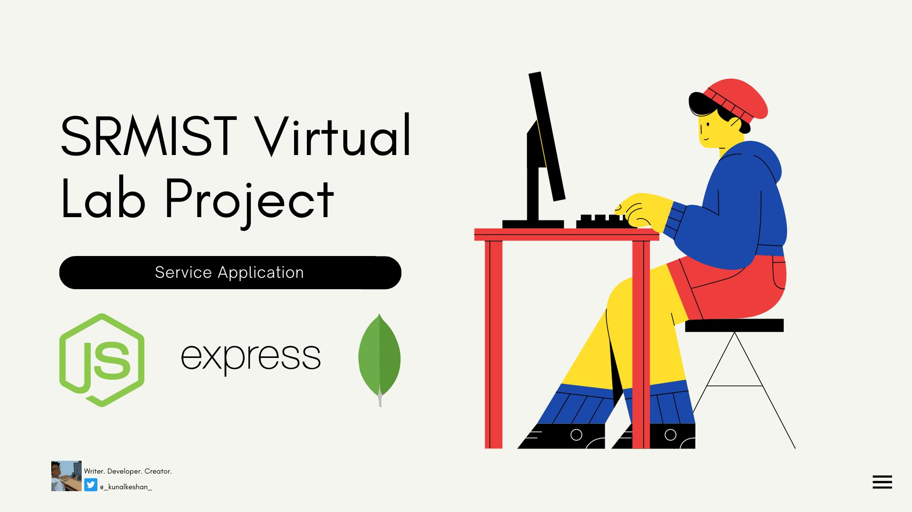

# SRMIST-VLab-Service

<p align="center">
    
</p>

This project is an initiative to provide a Virtual Lab Platform for SRMIST. It's divided into two parts as of now, the service application (the one you're currently in) and a [client application](https://github.com/kunalkeshan/SRMIST-VLab-Client) to view the subjects and the experiments details.

**Table of Contents**:

- [Quick Setup](#-quick-setup)
- [Contributing](#-contributing)
  - [Project Contributors](#-project-contributors)
- [License](#-license)
  - [Forking this Repo?](#-forking-this-repo)
- [Mentions](#-mentions)

## 🚀 Quick Setup

### Fork and Clone this Repo

```bash
git clone https://github.com/<your-github-username>/SRMIST-VLab-Service
```

### Install All Dependencies

```bash
npm install
```

### Setup Environment and Start the Application

To set up environment, refer to the [CONTRIBUTING.md](./CONTRIBUTING.md) guidelines on getting started.

```bash
npm run start:dev
```

## 📥 Contributing

This is project is open for contributions. To learn more about how to contribute, refer to the [CONTRIBUTING.md](./CONTRIBUTING.md) guidelines.

### 🦸 Project Contributors

Meet our contributors, without whom, this project wouldn't be possible.

<a href="https://github.com/kunalkeshan/SRMIST-VLab-Service/graphs/contributors">
  
</a>

## 📃 License

This project is licensed under the [MIT License](./LICENSE).

### ❓ Forking this Repo?

Many people have contacted us asking if they can use this code for their own websites. The answer to that question is usually "yes", with attribution. There are some cases, such as using this code for a business or something that is greater than a personal project, that we may be less comfortable saying yes to. If in doubt, please don't hesitate to ask us.

We value keeping this project open source, but as you all know, plagiarism is bad. We actively spend a non-negligible amount of effort developing, designing, and trying to perfect this iteration of our package, and we are proud of it! All we ask is to not claim this effort as your own.

So, feel free to fork this repo. If you do, please just give us proper credit by linking back to this repo, https://github.com/kunalkeshan/SRMIST-VLab-Service. Refer to this handy [quora](https://www.quora.com/Is-it-bad-to-copy-other-peoples-code) post if you're not sure what to do. Thanks!

## 🫂 Mentions

Part of this README was inspired from [https://github.com/SneakySensei/react-lean-modal](https://github.com/SneakySensei/react-lean-modal).

---

<p align="center">
If you found this project interesting or helpful, leave a ⭐! It helps others learn more about this project.
</p>